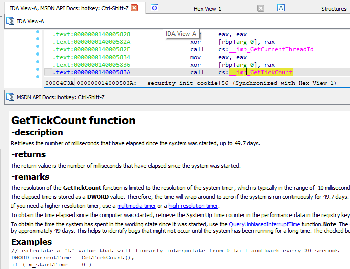

# msdocviewer
`msdocviewer` is a simple tool for viewing Microsoft's win32 API and driver technical documentation

## Description
`msdocviewer` consists of two parts. The first is a parser (`run_me_first.py`) that searches for all markdown files in the Microsoft [sdk-api](https://github.com/MicrosoftDocs/sdk-api) and [driver](https://github.com/MicrosoftDocs/windows-driver-docs-ddi) repository, it then checks if the document is related to a function and if so, it copies the document to a directory and then renames the file with their corresponding API name. For example, the file `nf-fileapi-createfilea.md` is renamed to `CreateFileA.md`. The second part is a markdown viewer that exists within an IDA plugin (`ida_plugin/msdocviewida.py`) that displays the document in IDA. An example of the output can be seen below. 



`msdocviewer` is similar to the old MSDN IDA viewers but doesn't rely on browsers, network requests or extracting the documents from a Visual Studio SDK. Since Microsoft started storing their API documents in Markdown and hosting them on GitHub, all the documents can be easily downloaded by cloning a repository. This is super useful because it is easy to copy the repositories to a portable drive or have them in a VM or host that doesn't have network access. It should also make it easy to port this code to other tools (e.g. Binary Ninja, Ghidra, etc).

#### Note
 The `.git` log for the `sdk-api` and `driver` repository takes up over 2GB of space. Deleting these files or their downloaded repositories does not affect the usage of the plugin because all of the needed files are saved to the `apis_md` directory. 

### Installation 
Clone this repository. *Note: Since the repository is using submodules it might take some time to download. The Microsoft sdk-api repository is over 1GB in size.*
```
git clone https://github.com/alexander-hanel/msdocsviewer.git
```
If `sdk-api` or `windows-driver-docs-ddi` are empty, the following commands needs to be executed 
```
cd msdocsviewer
git submodule update --init --recursive
```
If the above command errors out, execute it again. 

Once downloaded, execute `python run_me_first.py` then wait. Below is an example output. 

```
python.exe c:/Users/Admin/Documents/repo/msdocsviewer/run_me_first_copy.py 
INFO - deleting and overwriting apis_md directory
INFO - creating apis_md directory at C:\Users\Admin\Documents\repo\msdocsviewer\apis_md
INFO - starting the parsing, this can take a few minutes
INFO - parsing C:\Users\Admin\Documents\repo\msdocsviewer\sdk-api\sdk-api-src\content
INFO - parsing C:\Users\Admin\Documents\repo\msdocsviewer\sdk-api\sdk-api-src\content completed
INFO - parsing C:\Users\Admin\Documents\repo\msdocsviewer\windows-driver-docs-ddi\wdk-ddi-src\content
INFO - parsing C:\Users\Admin\Documents\repo\msdocsviewer\windows-driver-docs-ddi\wdk-ddi-src\content completed
INFO - finished parsing, if using IDA add path C:\Users\Admin\Documents\repo\msdocsviewer\apis_md to API_MD variable in idaplugin/msdocviewida.py
```

To update (**recommended**) the documention, execute the following command 

```
python.exe c:/Users/Admin/Documents/repo/msdocsviewer/run_me_first_copy.py --overwrite
```

There is also an option of `--log` to create a debug log to see all skipped files. Here is the help for `run_me_first_copy` 

```
usage: run_me_first_copy.py [-h] [-l] [-o]

msdocviewer parser component

optional arguments:
  -h, --help       show this help message and exit
  -l, --log        Log all parsing errors to debug-parser.log
  -o, --overwrite  overwrite apis_md directory
```

Edit `ida_plugin/msdocviewida.py` and add the directory path of `apis_md` to the `API_MD` variable (currently on line 19ish). Then copy `msdocviewida.py` to the `IDA` plugin directory. The following idapython command can be executed to find the plugin directory path. 

```
Python>import ida_diskio
Python>ida_diskio.get_user_idadir()
'C:\\Users\\Admin\\AppData\\Roaming\\Hex-Rays\\IDA Pro'
```
If a directory named `plugins` is not present, it needs to be created. 

### Requirements 
`pyaml` - strangely the yaml data can also be parsed as a markdown table   

### TODO 
* Port the plugin to Binary Ninja
